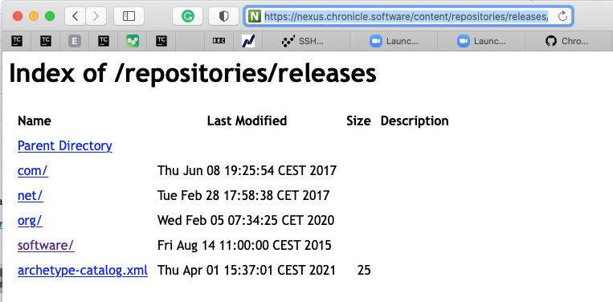
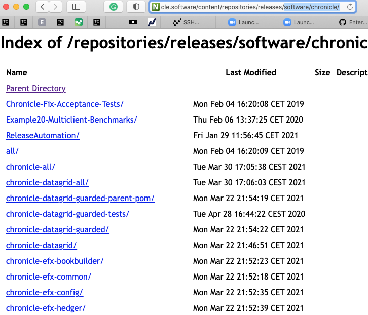

== Nexus Access

If you are a paying client we can grant you access to our nexus server, your credentials are as follows :

username: #*<TO BE PROVIDED>*#
password: #*<TO BE PROVIDED>*#

=== maven settings file

Please add the following maven setup up to your nexus server or settings.xml, please replace the *username* and *password* below, with those you have been provided with.

[source,xml]
----
 <servers>
        <server>
            <id>chronicle-enterprise-release</id>
            <username>username</username>
            <password>password</password>
        </server>
        <server>
            <id>chronicle-enterprise-snapshots</id>
            <username>username</username>
            <password>password</password>
        </server>
        <server>
            <id>third-party-release</id>
            <username>username</username>
            <password>password</password>
        </server>
    </servers>
----

== Nexus Web UI

You won't have access to our nexus UI, but to view the artifacts you have access to in a web browser navigate to:

link:https://nexus.chronicle.software/content/repositories/releases/[https://nexus.chronicle.software/content/repositories/releases/]

you will first be asked to authenticate, click on *login*

image::PastedGraphic-10.png[]

and enter your username and password.

image::PastedGraphic-11.png[]

once you have authenticated in, and in *the same browser session*, please go to the following URL:

link:https://nexus.chronicle.software/content/repositories/releases/[https://nexus.chronicle.software/content/repositories/releases]

for here you can see what artifacts are available.

I suggest click on *software* then *chronicle*.

*NOTE:* you will only see the products you have been permission for.

