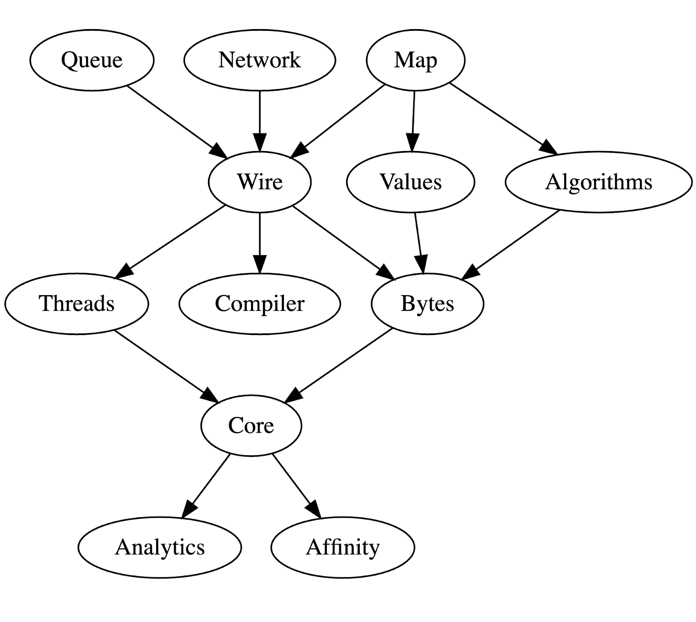

= Chronicle Maven Anatomy
Per Miborg

The various Chronicle libraries depends on each other in order to reuse common functionality.

== Simplified open-source anatomy
The simplified, one-level-depth, "anatomy" of some open-source Maven dependencies is illustrated hereunder:

_Figure 1: Simplified anatomy._

== Full depth open-source anatomy

Regarding the full depth of the open-source Maven dependency tree yields a more complex anatomy illustrated hereunder:

image::../images/Complex-Maven-Anatomy.png[Full Anatomy]
_Figure 2: Full anatomy._

== Source
The graphs above were obtained by running `mvn dependency:tree | grep compile | grep net.openhft` in the open-source libraries above and feeding information into a `.dot` file, for example:

[source, text]
----
digraph G {
    Queue -> Core ;
    Queue -> Bytes ;
    Queue -> Wire ;
    Queue -> Compiler ;
    Queue -> Threads ;
    Queue -> Affinity ;
    Queue -> Jlbh ;

    Network -> Core ;
    Network -> Threads ;
    Network -> Wire ;
    Network -> Bytes ;
    Network -> Compiler ;

    Map -> Core ;
    Map -> Values ;
    Map -> Bytes ;
    Map -> Threads ;
    Map -> Wire ;
    Map -> Compiler ;
    Map -> Algorithms ;

    Wire -> Core ;
    Wire -> Bytes ;
    Wire -> Threads ;
    Wire -> Affinity ;
    Wire -> Compiler ;

    Algorithms -> Core ;
    Algorithms -> Bytes ;

    Values -> Core ;
    Values -> Bytes ;

    Threads -> Affinity ;
    Threads -> Core ;

    Bytes -> Core ;

    Core -> Affinity ;
}
----

The `.dot` file was then rendered using the online tool https://dreampuf.github.io/GraphvizOnline/
